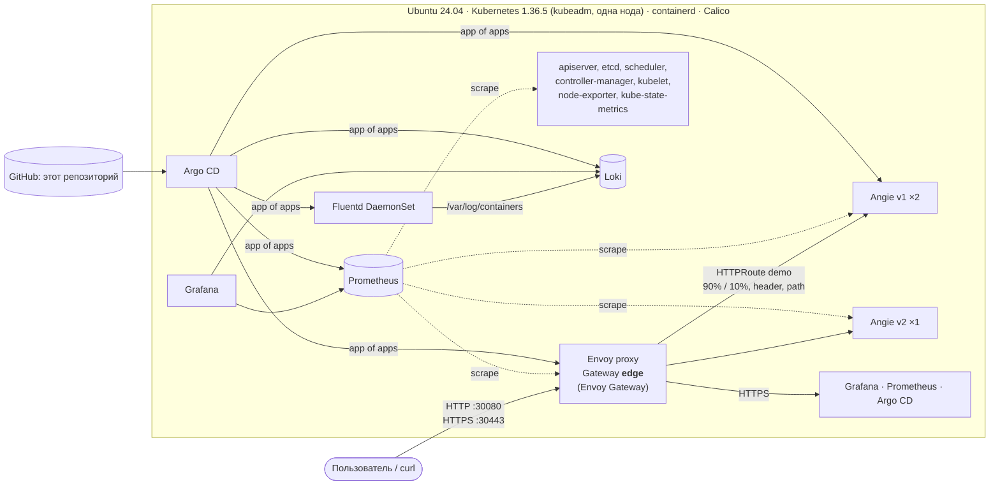

# MTC ENGINEER HACK 2026: DevOps

[](https://github.com/gifi71/mts-hack-2026/actions/workflows/ci.yml)
[](https://github.com/gifi71/mts-hack-2026/actions/workflows/security.yml)
[](https://github.com/gifi71/mts-hack-2026/actions/workflows/image-fluentd.yml)

Kubernetes-кластер на **kubeadm** с нуля на Ubuntu 24.04 и платформа вокруг демо-приложения:
публикация через **Gateway API** (Envoy Gateway), метрики в **Prometheus**, логи через **Fluentd** в Loki.
Всё ставится одной командой и проверяется второй:

```bash
make deploy    # Ansible: ОС → containerd → kubeadm → Calico → Argo CD → вся платформа через GitOps
make verify    # smoke-тесты: Gateway API, Prometheus, логи в Loki
```

Повторный `make deploy` ничего не меняет (`changed=0`). CI проверяет это на каждом коммите: поднимает кластер на чистом раннере `ubuntu-24.04` (около 13 минут), повторяет развёртывание и запускает `make verify`.

## Содержание

- [Архитектура](#архитектура)
- [Версии](#версии) и [совместимость](#совместимость)
- [Требования](#требования)
- [Развёртывание](#развёртывание)
- [Проверка](#проверка): [приложение и Gateway API](#приложение-и-gateway-api), [мониторинг](#мониторинг), [логи](#логирование)
- [Дополнительные возможности](#дополнительные-возможности)
- [CI/CD](#cicd)
- [Структура репозитория](#структура-репозитория)
- [Ограничения](#ограничения)

## Архитектура



Как идёт развёртывание:

1. **OpenTofu** (опционально) создаёт ВМ Ubuntu 24.04 на Proxmox и пишет Ansible inventory.
2. **Ansible** готовит ОС, ставит containerd, kubeadm, Calico, Helm и Argo CD. Затем создаёт root Application.
3. **Argo CD** синхронизирует `gitops/apps`: Helm-чарт с Application на каждый компонент.
   Порядок задают sync-waves: хранилище и CRD → Prometheus → Envoy Gateway, cert-manager, Loki → Gateway, мониторы, Fluentd → приложение.
4. Ansible ждёт, пока все Application станут `Synced/Healthy`. После этого `make deploy` завершается.

Почему так устроено, описано в [docs/adr](docs/adr).

## Версии

| Компонент | Версия | Как ставится |
|---|---|---|
| Ubuntu | 24.04.5 LTS | ВМ (OpenTofu или вручную) |
| **Kubernetes** | **1.36.5** | kubeadm, kubelet, kubectl из `pkgs.k8s.io` |
| containerd / runc | 2.2.1 / 1.3.4 | пакеты Ubuntu `noble-updates` |
| Calico (CNI) | 3.32.2 | tigera-operator, Helm (Ansible), VXLAN |
| Helm | 3.22.0 | Ansible, бинарник с проверкой sha256 |
| Argo CD | 3.5.3 (чарт 10.9.6) | Helm (Ansible) |
| **Gateway API** | **1.6.1, standard channel** | чарт `gateway-crds-helm` v1.9.2 |
| **Envoy Gateway** | **1.9.2** (Envoy 1.39.1) | Argo CD, чарт завендорен в репозиторий |
| cert-manager | 1.21.2 | Argo CD |
| kube-prometheus-stack | 91.8.2: Prometheus 3.15.0, Operator 0.94.1, Grafana 13.2.3, Alertmanager 0.34.1 | Argo CD |
| Loki | 3.7.8 (чарт 18.13.7, monolithic) | Argo CD |
| **Fluentd** | **1.19.3** + fluent-plugin-grafana-loki 1.3.0 | Argo CD, свой образ `ghcr.io/gifi71/mts-hack-2026/fluentd` |
| Angie (приложение) | 1.12.2 | Argo CD, Kustomize |
| local-path-provisioner | 0.0.37 | Argo CD |
| ansible-core | 2.21.4 | `make deps` в `.venv`, по хешам из [ansible/requirements.txt](ansible/requirements.txt) |
| OpenTofu | ≥ 1.8 (проверено на 1.12.6), провайдер bpg/proxmox 0.114.0 | опционально |

Версии зафиксированы: пакеты Kubernetes, чарты, образы (Angie и Fluentd по digest), коллекции Ansible, провайдеры OpenTofu.
Python-зависимости управляющей машины зафиксированы lock-файлом с хешами: ansible-core и все его транзитивные
зависимости ставятся через `pip install --require-hashes`. Lock генерирует uv (`make lock`), CI проверяет,
что он совпадает с `ansible/requirements.in`. Для установки uv не нужен.
Исключение: containerd ставится как `2.2.*` из `noble-updates` вместе с runc из Ubuntu. Ubuntu удаляет старые сборки
из архива, и точный пин сломал бы установку после очередного обновления пакета.

### Совместимость

Версия Kubernetes выбрана как последняя минорная, которую официально поддерживают все компоненты.
Сверено с матрицами проектов на 2 октября 2026.

| Компонент | Версия | Поддерживаемые Kubernetes | 1.37 |
|---|---|---|---|
| Calico | 3.32.2 | 1.34, 1.35, 1.36 ([requirements](https://docs.tigera.io/calico/3.32/getting-started/kubernetes/requirements)) | с Calico 3.33 |
| Argo CD | 3.5.3 | 1.33, 1.34, 1.35, 1.36 ([tested versions](https://argo-cd.readthedocs.io/en/stable/operator-manual/tested-kubernetes-versions/)) | нет |
| cert-manager | 1.21.2 | 1.33, 1.34, 1.35, 1.36 ([releases](https://cert-manager.io/docs/releases/)) | нет |
| Envoy Gateway | 1.9.2, Gateway API 1.6.1 | 1.33, 1.34, 1.35, 1.36 ([matrix](https://gateway.envoyproxy.io/news/releases/matrix/)) | нет |
| kube-state-metrics | 2.20.0 | client-go 1.36 ([matrix](https://github.com/kubernetes/kube-state-metrics#compatibility-matrix)) | нет |
| containerd | 2.2.1 (Ubuntu 24.04) | 1.36 требует 2.2+ ([RELEASES.md](https://github.com/containerd/containerd/blob/main/RELEASES.md#kubernetes-support)) | нужен 2.3+ |

Поэтому **Kubernetes 1.36.5**, хотя уже вышла 1.37.1. Сознательно не обновлены:

- Calico 3.33.0: вышел 1 октября, первый релиз ветки, для 1.36 ничего не добавляет;
- Gateway API 1.6.2: Envoy Gateway 1.9.2 поставляется и тестируется с 1.6.1;
- Fluentd 1.19.4: для него ещё нет образа `fluent/fluentd-kubernetes-daemonset`, на котором построен наш образ.

Версия Kubernetes задаётся одной переменной `k8s_version` в [ansible/group_vars/all/main.yml](ansible/group_vars/all/main.yml).

## Требования

**Проверено на**: Ubuntu 24.04.5 LTS (cloud image, ВМ на Proxmox, 4 vCPU, 8 ГБ RAM, 30 ГБ диска) и раннер
GitHub Actions `ubuntu-24.04` (каждый коммит, job `e2e`).

**Узел кластера**: одна ВМ **Ubuntu 24.04** amd64, 4 vCPU, 8 ГБ RAM, 30 ГБ свободного места на `/`, доступ в интернет,
без Docker: его пакет `containerd.io` конфликтует с containerd из Ubuntu, который ставит решение.
Перед установкой `make deploy` проверяет RAM, место на диске, отсутствие Docker и то, что сеть узла
не пересекается с подсетями подов (`10.244.0.0/16`) и сервисов (`10.96.0.0/12`). Если пересекается, задайте другие:
`make deploy ANSIBLE_ARGS="-e k8s_pod_subnet=172.20.0.0/16 -e k8s_service_subnet=172.21.0.0/16"`.

**sudo без пароля.** В cloud image Ubuntu так настроено по умолчанию. Если ВМ поставлена с ISO, есть два варианта:

```bash
echo "$USER ALL=(ALL) NOPASSWD:ALL" | sudo tee /etc/sudoers.d/90-$USER   # один раз
# или вводить пароль sudo при каждом запуске:
make deploy INVENTORY=... ANSIBLE_ARGS=-K
```

Запускать `make` нужно от обычного пользователя, без `sudo make`.

**Сеть.** IP узла должен быть постоянным: kubeadm записывает его в сертификаты, и после смены адреса кластер
не поднимется. Клиент должен доходить до узла по TCP 30080 и 30443, для варианта 2 ещё по 22.

- VirtualBox в режиме NAT: ВМ не видна с хоста, нужен сетевой адаптер «Сетевой мост» или «Виртуальный адаптер хоста».
- Hyper-V Default Switch меняет IP ВМ после перезагрузки хоста: лучше внешний коммутатор или статический IP.
- Облако: открыть 30080/30443 (и 22) в security group или firewall.

**Машина, с которой запускается развёртывание** (можно та же ВМ): `make`, `git`, Python ≥ 3.12 с `venv`, `ssh`.
Linux, macOS или WSL2 на Windows. На Ubuntu 24.04:

```bash
sudo apt-get update && sudo apt-get install -y make git python3-venv
```

Ansible и коллекции `make deploy` ставит сам в `.venv`, их версии зафиксированы.

## Развёртывание

### Вариант 1. Прямо на ВМ (самый короткий)

На чистой Ubuntu 24.04:

```bash
git clone https://github.com/gifi71/mts-hack-2026.git && cd mts-hack-2026
make deploy INVENTORY=ansible/inventory/localhost.yml   # 15-20 минут, в основном скачивание образов
make verify INVENTORY=ansible/inventory/localhost.yml
```

Этот же сценарий выполняет CI на чистом раннере `ubuntu-24.04`.

### Вариант 2. С рабочей машины по SSH

```bash
git clone https://github.com/gifi71/mts-hack-2026.git && cd mts-hack-2026
cp ansible/inventory/hosts.example.yml ansible/inventory/hosts.yml
# в hosts.yml: ansible_host (IP ВМ), ansible_user, ansible_ssh_private_key_file
ssh-keyscan -H <IP ВМ> >> ~/.ssh/known_hosts   # или один раз зайти по ssh: Ansible проверяет ключ хоста
make deploy INVENTORY=ansible/inventory/hosts.yml
make verify INVENTORY=ansible/inventory/hosts.yml
```

### Вариант 3. Создать ВМ на Proxmox через OpenTofu

```bash
cp infra/tofu/proxmox/terraform.tfvars.example infra/tofu/proxmox/terraform.tfvars   # узел, сеть, IP
export PROXMOX_VE_ENDPOINT=https://<pve>:8006/ PROXMOX_VE_API_TOKEN='tofu@pve!mts=<secret>'
make infra-up    # ВМ + ansible/inventory/generated/proxmox.yml + known_hosts с ключом хоста
make deploy      # inventory подхватывается автоматически
make verify
```

Подготовка Proxmox и все параметры: [infra/tofu/README.md](infra/tofu/README.md).

**Если `make deploy` упал** (например, на ожидании Argo CD из-за медленного скачивания образов), запустите его ещё раз:
повторный запуск безопасен и продолжит с того же места. Состояние приложений: `make ssh`, затем
`kubectl -n argocd get applications`.

**Свой форк.** Argo CD синхронизирует платформу из этого репозитория на GitHub, а не из локальной копии.
Для своего форка: `make deploy ANSIBLE_ARGS="-e gitops_repo_url=https://github.com/<you>/<fork>.git"`.

Остальные команды: `make help`.

## Проверка

`make verify` выполняет все проверки ниже на узле и печатает `PASS/FAIL` по каждой.
Пример вывода со стенда автора:

```
== Cluster
PASS  node Ready: v1.36.5
PASS  Argo CD: 11 applications Synced/Healthy
== Gateway API (Envoy Gateway, NodePort http://<IP узла>:30080)
PASS  Gateway edge Programmed (True)
PASS  curl http://<IP узла>:30080/ -> 'Hello World! (angie v1)'
PASS  HTTPS with the cert-manager CA -> 'Hello World! (angie v1)'
PASS  header X-Canary: always -> v2 ('Hello World! (angie v2)')
PASS  path /v2/ (rewritten to /) -> v2 ('Hello World! (angie v2)')
PASS  traffic split 90/10: v2 served 9/100 requests
PASS  curl http://<IP узла>:30080/missing -> 404 (expected 404)
PASS  curl http://<IP узла>:30080/error -> 500 (expected 500)
== Prometheus
PASS  target angie-v1 up (2 pods)
PASS  target angie-v2 up (1 pods)
PASS  Envoy targets up (2)
PASS  PromQL angie_http_server_zones_responses{zone="demo"}: 3 series
PASS  PromQL: Envoy, node-exporter, kube-state-metrics, apiserver metrics (4/4)
== Logging (Fluentd -> Loki)
PASS  access log (stdout) for ?marker=verify-1791020112-16880 found in Loki:
      {"time":"2026-10-03T09:35:17+00:00","app":"demo","version":"v1",...,"uri":"/?marker=verify-...","status":200,...}
PASS  error log (stderr) for /missing?marker=verify-1791020112-16880 found in Loki:
      ... [error] 7#7: *16 open() "/nonexistent/missing" failed (2: No such file or directory) ...
All checks passed.
```

Ниже то же самое руками. Команды `kubectl` выполняются на узле (`make ssh`).

### Приложение и Gateway API

Envoy Gateway публикует Gateway `edge` через NodePort: **HTTP `30080`**, **HTTPS `30443`**.

```bash
NODE=<IP узла>

curl http://$NODE:30080/
# Hello World! (angie v1)

# HTTPS по имени, сертификат выпущен cert-manager из локального CA
make ca-cert    # сохранит mts-hack-ca.crt
curl --cacert mts-hack-ca.crt --resolve app.mts-hack.local:30443:$NODE https://app.mts-hack.local:30443/

# маршрутизация по заголовку и пути
curl -H 'Host: app.mts-hack.local' -H 'X-Canary: always' http://$NODE:30080/   # -> v2
curl -H 'Host: app.mts-hack.local' http://$NODE:30080/v2/                      # -> v2, префикс срезан

# traffic splitting 90/10
for i in $(seq 100); do curl -s -H 'Host: app.mts-hack.local' http://$NODE:30080/; done | sort | uniq -c
```

Ресурсы Gateway API ([gitops/platform/gateway](gitops/platform/gateway), [gitops/workloads/demo-app/httproute.yaml](gitops/workloads/demo-app/httproute.yaml)):

| Ресурс | Что делает |
|---|---|
| `GatewayClass envoy` | контроллер Envoy Gateway, параметры из `EnvoyProxy nodeport` (NodePort 30080/30443) |
| `Gateway edge` | слушатели `http :80` (любой host) и `https :443` (`*.mts-hack.local`, TLS terminate) |
| `HTTPRoute demo` | `app.mts-hack.local`: заголовок `X-Canary: always` → v2; `/v2` → v2 с `URLRewrite`; остальное 90/10; таймаут 5 с; заголовок ответа `X-Served-By` |
| `HTTPRoute demo-default` | без hostname: `curl http://<узел>:30080/` работает без заголовка Host |
| `HTTPRoute https-redirect` | HTTP → HTTPS (301) для Grafana, Prometheus, Argo CD |
| `HTTPRoute grafana / prometheus / argocd` | UI платформы по HTTPS |

Gateway принимает маршруты только из перечисленных namespace (`allowedRoutes` с селектором).

**UI в браузере.**

1. Добавьте в `hosts` строку:
   ```
   <IP узла> app.mts-hack.local grafana.mts-hack.local prometheus.mts-hack.local argocd.mts-hack.local
   ```
   Linux и macOS: `/etc/hosts`. Windows: `C:\Windows\System32\drivers\etc\hosts`, редактор от имени администратора.
   Имена `*.mts-hack.local` есть только в `hosts`, DNS для них нет.
2. Чтобы браузер доверял сертификату, импортируйте CA. `make ca-cert` сохранит `mts-hack-ca.crt` в корень репозитория
   на машине, где запущен `make` (в варианте 1 это ВМ). Забрать файл на Windows из PowerShell:
   `scp <user>@<IP узла>:mts-hack-2026/mts-hack-ca.crt .`
   - Windows (Chrome, Edge): `certutil -user -addstore Root mts-hack-ca.crt`.
   - Firefox хранит сертификаты отдельно: Настройки → Приватность и защита → Сертификаты → Просмотр сертификатов →
     Центры сертификации → Импорт.

   Без CA браузер покажет предупреждение, его можно пропустить.
3. Откройте:

   | Адрес | Что |
   |---|---|
   | `http://app.mts-hack.local:30080` | приложение (Hello World) |
   | `https://app.mts-hack.local:30443` | приложение по HTTPS |
   | `https://grafana.mts-hack.local:30443` | Grafana: дашборды «MTS Hack: gateway, app, logs», ArgoCD, Envoy Gateway, Explore → Loki |
   | `https://prometheus.mts-hack.local:30443` | Prometheus: `/targets`, `/alerts` |
   | `https://argocd.mts-hack.local:30443` | Argo CD |

   Логины и пароли выводит `make credentials`.

**Windows без WSL.** В PowerShell `curl` это псевдоним `Invoke-WebRequest`, поэтому команды выше запускайте как `curl.exe`:
`curl.exe http://<IP узла>:30080/`. Bash-примеры (`for`, `$NODE`) выполняйте на узле (`make ssh`) или в WSL.

### Мониторинг

Prometheus ставится kube-prometheus-stack (Prometheus Operator). Что собирается:

| Источник | Метрики | Как подключено |
|---|---|---|
| Angie | запросы, ответы по кодам, байты, соединения (`angie_http_server_zones_*`, `angie_connections_*`) | встроенный модуль `prometheus` Angie, `ServiceMonitor angie` |
| Envoy (data plane) | RPS, коды ответов, latency по маршрутам (`envoy_cluster_upstream_rq_*`, `envoy_http_downstream_*`) | `PodMonitor envoy-proxy` |
| Envoy Gateway | контроллер | `ServiceMonitor envoy-gateway` |
| Узел | CPU, RAM, диск, сеть | node-exporter |
| Kubernetes | состояние объектов, apiserver, etcd, scheduler, controller-manager, kubelet/cAdvisor, kube-proxy, CoreDNS | kube-state-metrics и мониторы чарта; метрики control plane открыты в конфиге kubeadm |
| Платформа | Argo CD, cert-manager, Fluentd, Calico (Felix) | ServiceMonitor каждого компонента |

Проверка в UI: `https://prometheus.mts-hack.local:30443/targets` или через API на узле:

```bash
q() { kubectl get --raw "/api/v1/namespaces/monitoring/services/kube-prometheus-stack-prometheus:9090/proxy/api/v1/query?query=$(python3 -c 'import sys,urllib.parse;print(urllib.parse.quote(sys.argv[1]))' "$1")"; }
q 'up{namespace="demo"}'
q 'sum by (code) (rate(angie_http_server_zones_responses{zone="demo"}[5m]))'
q 'sum by (envoy_cluster_name) (rate(envoy_cluster_upstream_rq_total[5m]))'
```

Хранение 3 дня (`retention: 3d`, лимит 6 ГБ), том на local-path.

### Логирование

**Fluentd** работает как DaemonSet ([gitops/platform/logging/fluentd.yaml](gitops/platform/logging/fluentd.yaml)):

1. читает `/var/log/containers/*.log` всех подов, формат CRI;
2. добавляет метаданные Kubernetes (namespace, pod, labels);
3. access-лог Angie пишется в stdout в JSON, Fluentd разбирает его на поля: `status`, `uri`, `request_time`, `version`, `request_id`;
4. error-лог Angie пишется в stderr и попадает в Loki с меткой `stream="stderr"`;
5. отправляет в **Loki** с метками `namespace`, `pod`, `container`, `app`, `stream`.

Чтобы получить ошибки, в приложении есть `/missing` (404 и строка в error-логе) и `/error` (500).

Loki хранит логи 3 дня, как и Prometheus. Смотреть логи: Grafana → Explore → Loki, или через API на узле:

```bash
curl -s "http://$NODE:30080/?marker=check-123" >/dev/null
sleep 10
kubectl get --raw '/api/v1/namespaces/logging/services/loki:3100/proxy/loki/api/v1/query_range?query=%7Bnamespace%3D%22demo%22%7D%20%7C%3D%20%22check-123%22&limit=5'
```

LogQL для Grafana (Explore → Loki):

```
{namespace="demo", stream="stdout"} | json | status >= 400     # access-лог: 404 и 500
{namespace="demo", stream="stderr"}                            # error-лог Angie
```

## Дополнительные возможности

- **Расширенный Gateway API**: HTTPS с cert-manager, редирект HTTP → HTTPS, маршрутизация по hostname, path и заголовку, rewrite пути, traffic splitting 90/10, таймауты, изменение заголовков ответа, несколько backend.
- **GitOps**: Argo CD, app of apps, sync-waves, self-heal. Изменения в кластер попадают только через git.
- **Идемпотентность проверяется в CI**: `make deploy` запускается дважды, job падает, если второй прогон что-то изменил.
- **Алерты** (PrometheusRule): недоступность приложения и Envoy, доля 5xx, p95 времени ответа, ошибки доставки логов Fluentd.
  Видны в Prometheus `/alerts` и Alertmanager, канал уведомлений не настроен.
- **Безопасность**:
  - namespace приложения под Pod Security `restricted`;
  - контейнер non-root, read-only root FS, без capabilities, seccomp `RuntimeDefault`;
  - NetworkPolicy default-deny, разрешены только Envoy → приложение и Prometheus → метрики;
  - секреты (пароль Grafana) генерируются при установке и в репозитории не хранятся;
  - host key ВМ закреплён в `known_hosts`, `StrictHostKeyChecking` включён.
- **Цепочка поставки**: свой образ Fluentd собирается в CI ([images/fluentd](images/fluentd/Dockerfile)):
  - Debian-пакеты обновляются из snapshot.debian.org на зафиксированную дату: патчи безопасности есть, а версии пакетов при пересборке те же;
  - до публикации образ проверяется и сканируется Trivy, исправимые HIGH и CRITICAL останавливают сборку;
  - в ghcr.io уходит только из `main`, с SBOM и SLSA provenance, и подписывается cosign (keyless).

  Образ Fluentd, его база и Angie закреплены по digest. Workflow `security` проверяет подпись
  задеплоенного образа и пересканирует его на каждый push и раз в неделю. Проверить подпись вручную:

  ```bash
  cosign verify ghcr.io/gifi71/mts-hack-2026/fluentd:v1.19.3-loki1.3.0-deb20261003-a92b22c \
    --certificate-identity-regexp '^https://github.com/gifi71/mts-hack-2026/.github/workflows/image-fluentd.yml@refs/heads/main$' \
    --certificate-oidc-issuer https://token.actions.githubusercontent.com
  ```
- **Меньше зависимости от Docker Hub**: containerd тянет образы `docker.io` (Envoy, Grafana, Loki и др.) сначала через зеркало `mirror.gcr.io`, чарт Envoy Gateway завендорен, Calico ставится из GitHub Releases.
- **Надёжность приложения**: 3 реплики, readiness и liveness probes, PodDisruptionBudget, rolling update без простоя.
- **Наблюдаемость платформы**: метрики control plane, Argo CD, cert-manager, Fluentd, Calico.
  Дашборды лежат в [gitops/platform/monitoring/manifests/dashboards](gitops/platform/monitoring/manifests/dashboards), Grafana подхватывает их из ConfigMap:
  свой «MTS Hack: gateway, app, logs», официальные ArgoCD, Envoy Gateway Global, Envoy Global, Envoy Clusters,
  плюс стандартные дашборды kube-prometheus-stack (кластер, ноды, поды).

## CI/CD

[.github/workflows](.github/workflows):

| Workflow | Что делает |
|---|---|
| `ci` / lint | хуки pre-commit ([.pre-commit-config.yaml](.pre-commit-config.yaml)): yamllint, ansible-lint (профиль `production`), shellcheck, hadolint, actionlint, `tofu fmt`, проверки файлов; затем `tofu validate/test`, helm lint, kubeconform по всем отрендеренным манифестам, сверка lock-файла Python |
| `ci` / e2e | чистый раннер `ubuntu-24.04`: `make deploy` с kubeadm, повторный `make deploy` (должен быть `changed=0`), `make verify` |
| `security` / secrets | gitleaks по всей истории git, падает на любом найденном секрете |
| `security` / iac | Trivy config (Kubernetes, Dockerfile, OpenTofu): все находки в Security, HIGH и CRITICAL валят job |
| `security` / image | cosign verify и Trivy задеплоенного образа Fluentd: исправимые HIGH и CRITICAL валят job на push и PR. В Security видны и CVE без исправления в Debian (пустой Fixed Version): их не закрыть обновлением, гейт их не учитывает. Еженедельный запуск только обновляет Security, чтобы CVE, опубликованная после сдачи, не меняла статус коммита |
| `image-fluentd` | сборка образа Fluentd, проверка, Trivy (гейт до публикации), push в ghcr.io с SBOM и provenance, подпись cosign |

Принятые исключения сканеров с обоснованием: [.trivyignore](.trivyignore) (IaC), [images/fluentd/.trivyignore.yaml](images/fluentd/.trivyignore.yaml) (образ).

Те же проверки, что в `ci` / lint, запускаются локально перед каждым коммитом:
`make hooks` ставит git-хуки, `make lint` прогоняет их по всему репозиторию. Нужны `pre-commit` (`pipx install pre-commit` или `uvx pre-commit`) и `tofu`.

CD выполняет Argo CD: после merge в `main` кластер приводится к состоянию из git.

## Структура репозитория

```
infra/tofu/           OpenTofu: ВМ на Proxmox, inventory и known_hosts (опционально)
ansible/              роли: node_prep, containerd, kubernetes, helm, kubeadm, calico, platform_secrets, argocd
gitops/apps/          app of apps: Helm-чарт с Argo CD Application на каждый компонент
gitops/platform/      values и манифесты компонентов (gateway, monitoring, logging, cert-manager, ...)
gitops/workloads/     демо-приложение Angie (Kustomize: base + v1/v2)
images/fluentd/       Dockerfile образа Fluentd с плагином Loki
tests/smoke/          verify.sh, запускается через make verify
docs/adr/             архитектурные решения
docs/passport/        паспорт решения (make passport)
docs/task/            текст кейса и ответы организаторов на Q&A-сессии
```

## Ограничения

- **Одна нода.** Control plane без taint, рабочая нагрузка на нём же. HA нет. Inventory разделён на
  `control_plane` и `workers`, но добавление worker-нод не реализовано и не проверено.
- **NodePort вместо LoadBalancer.** Порты 30080 и 30443 вместо 80 и 443. Так работает в любой сети,
  включая облачные, где нет L2-анонсов для MetalLB.
- **Самоподписанный CA.** Для HTTPS клиенту нужен `mts-hack-ca.crt` (`make ca-cert`) или `curl -k`.
- **Prometheus, Grafana и Argo CD UI** доступны через Gateway любому, кто достаёт до узла. Grafana и Argo CD
  требуют пароль, Prometheus нет. Для стенда допустимо, в проде нужна аутентификация на Gateway (OIDC) или отдельная сеть.
- **Хранилище local-path**: данные Prometheus и Loki живут на диске ноды и пропадают вместе с ней.
- **State OpenTofu** хранится локально.
- **Нужен интернет** на узле: пакеты, образы, чарты и этот репозиторий для Argo CD. Организаторы на Q&A подтвердили,
  что у проверяющих он есть ([docs/task/qa-2026-10-02.md](docs/task/qa-2026-10-02.md)). Из некоторых российских сетей
  без VPN недоступны Docker Hub, `get.helm.sh`, `registry.k8s.io`, `ghcr.io`, `mirror.gcr.io` и чарты на `*.github.io`.
  По умолчанию зеркало настроено только для `docker.io`. Свои зеркала реестров и адрес Helm задаются файлом
  [ansible/mirrors.example.yml](ansible/mirrors.example.yml): `make deploy ANSIBLE_ARGS="-e @ansible/mirrors.yml"`.
  Helm-чарты (`*.github.io`, `charts.jetstack.io`, релизы Calico на `github.com`) и сам репозиторий качаются напрямую,
  для них нужен прокси или VPN.
- **Argo CD берёт код из GitHub**, а не из локальной копии: локальные правки в `gitops/` в кластер не попадут.
- **Только amd64**: бинарник Helm и образ Fluentd собраны под amd64.
- **IP узла постоянный**: он зашит в сертификаты kubeadm.
- **Метрики control plane на всех интерфейсах узла**: etcd (`:2381`) и kube-proxy (`:10249`) отдают метрики по HTTP
  без аутентификации. Для стенда допустимо, в проде их закрывают firewall или ставят прокси с mTLS.
- **Fluentd работает от root.** Ему нужен доступ к `/var/log` ноды, поэтому namespace `logging` не под PSA `restricted`.
