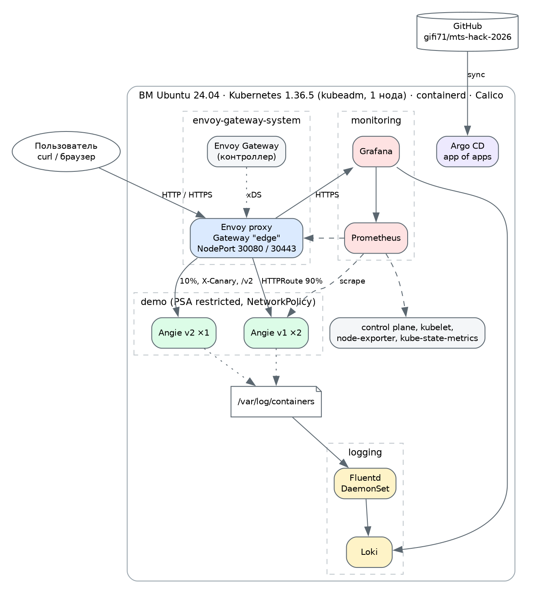

# Паспорт решения. MTC ENGINEER HACK 2026, кейс DevOps

Репозиторий: https://github.com/gifi71/mts-hack-2026 (ветка `main`)

## 1. Архитектура и состав решения

| Параметр | Значение |
|---|---|
| Версия Kubernetes | 1.36.5 |
| Способ развёртывания Kubernetes | kubeadm, одна нода (control plane без taint), containerd 2.2, CNI Calico 3.32 (VXLAN) |
| Реализация Gateway API | Envoy Gateway 1.9.2, Gateway API 1.6.1 (standard channel) |
| Инструменты автоматизации | Ansible 2.21 (узел, kubeadm, bootstrap), Argo CD 3.5 (GitOps, app of apps), Helm, Kustomize, OpenTofu (ВМ на Proxmox, опционально), Make |
| Логирование | **Fluentd** 1.19.3 (DaemonSet) → Loki 3.7.8 → Grafana |
| Prometheus | kube-prometheus-stack 91.8.2 (Prometheus Operator) через Argo CD |
| ОС, на которой проверено | Ubuntu 24.04.5 LTS: ВМ на Proxmox и раннер GitHub Actions `ubuntu-24.04` |

Запуск: `make deploy`, проверка: `make verify`.

## 2. Реализованный функционал

### Обязательная часть

| Пункт | Как реализован | Почему так | Как проверить |
|---|---|---|---|
| Kubernetes | Ansible-роли: подготовка ОС, containerd, пакеты из pkgs.k8s.io, `kubeadm init` по конфигу v1beta4, Calico | kubeadm в приоритете ТЗ; одна ВМ минимизирует ручные действия эксперта | `make verify` → `node Ready: v1.36.5` |
| Приложение | Angie 1.12.2 (open-source веб-сервер), две версии из одной Kustomize-базы, ответ `Hello World! (angie v1)` | Angie указан в ТЗ, у него встроенные Prometheus-метрики | `curl http://<IP>:30080/` |
| Gateway API | GatewayClass `envoy` + EnvoyProxy (NodePort 30080/30443), Gateway `edge` (HTTP и HTTPS), HTTPRoute | Envoy Gateway: CNCF-референс Gateway API; NodePort работает в любой сети | `make verify`, раздел Gateway API |
| Мониторинг | kube-prometheus-stack, ServiceMonitor/PodMonitor для Angie, Envoy, Argo CD, Calico; метрики control plane | Prometheus Operator: мониторы описываются рядом с компонентом | `make verify`: target-ы `up`, PromQL по `angie_http_server_zones_responses` |
| Логирование | Fluentd DaemonSet: CRI-логи, метаданные Kubernetes, разбор JSON access-лога Angie, отправка в Loki | Fluentd разрешён ТЗ; Loki лёгкий и встраивается в ту же Grafana | `make verify`: запрос с уникальной меткой находится в Loki |
| Ubuntu 24.04 | проверено на ВМ Proxmox и в CI на `ubuntu-24.04` | | вкладка Actions репозитория |
| Автоматизация | `make deploy` (Ansible + Argo CD), повторный запуск ничего не меняет | | CI: второй `make deploy` обязан дать `changed=0` |

### Дополнительные улучшения

| Что | Как | Зачем | Как проверить |
|---|---|---|---|
| Расширенный Gateway API | HTTPS (cert-manager, свой CA), редирект HTTP→HTTPS, маршруты по hostname, path, заголовку, `URLRewrite`, split 90/10, таймауты, заголовки ответа | показать возможности Gateway API из ТЗ | `make verify`: HTTPS, `X-Canary`, `/v2`, split |
| GitOps | Argo CD, app of apps, sync-waves, self-heal, server-side diff | изменения только через git, дрейф исправляется сам | `argocd.mts-hack.local:30443` |
| CI/CD | lint (yamllint, ansible-lint production, shellcheck, tofu test, kubeconform), security (gitleaks, Trivy), e2e kubeadm на чистой Ubuntu 24.04 | доказывает воспроизводимость и идемпотентность на каждом коммите | Actions → `ci` |
| Цепочка поставки | свой образ Fluentd: Trivy, SBOM, SLSA provenance, подпись cosign; базовые образы по digest | DevSecOps на реальном артефакте | `cosign verify ghcr.io/gifi71/mts-hack-2026/fluentd:v1.19.3-loki1.3.0 ...` |
| Безопасность в кластере | PSA `restricted`, non-root, read-only FS, NetworkPolicy default-deny, секреты генерируются при установке | минимальные права приложения | `kubectl -n demo get netpol`, `kubectl get ns demo --show-labels` |
| Расширенная наблюдаемость | дашборд Grafana как код, алерты (доступность, 5xx, p95, ошибки доставки логов), метрики control plane, структурированные логи | RPS, коды, latency, CPU/RAM в одном месте | Grafana → «MTS Hack: gateway, app, logs» |
| Работа при блокировках | зеркало `mirror.gcr.io` для Docker Hub в containerd, завендоренный чарт Envoy Gateway, Calico из GitHub Releases, resolv.conf без чужих search-доменов | установка не зависит от Docker Hub и сетевых особенностей | `cat /etc/containerd/certs.d/docker.io/hosts.toml` |
| Провижининг ВМ | OpenTofu: ВМ на Proxmox, cloud-init, inventory, закреплённый host key | цикл «с нуля» одной командой | `make infra-up` |

## 3. Ревью и масштабирование

**Главная особенность.** Решение проверяет само себя. CI на каждом коммите поднимает kubeadm-кластер на чистой Ubuntu 24.04, разворачивает всю платформу, повторяет развёртывание с требованием `changed=0` и прогоняет те же проверки, что `make verify` у эксперта.

**Самое сложное решение.** Как публиковать Gateway: LoadBalancer с MetalLB или NodePort. MetalLB выглядит «как в проде», но L2-анонсы не работают в облачных сетях, а эксперту пришлось бы подбирать свободные адреса в своей сети. Выбран NodePort с фиксированными портами через EnvoyProxy: он работает на любой ВМ без настройки (ADR 0002).

**Развитие:**

- **HA control plane** (3 ноды + kube-vip) и worker-ноды. Нужны ещё 4+ ВМ, проверка в CI через вложенную виртуализацию.
- **LoadBalancer** через MetalLB (BGP с маршрутизаторами оператора) или внешний балансировщик вместо NodePort. Нужен доступ к сетевому оборудованию.
- **Внешнее хранилище:** S3-совместимое для Loki и Thanos/VictoriaMetrics для долгого хранения метрик. Нужно объектное хранилище.
- **Аутентификация на Gateway** через SecurityPolicy Envoy Gateway и OIDC (Keycloak). Нужен IdP.
- **Политики admission** (Kyverno): запрет образов без подписи cosign, обязательные лимиты.
- **Телеком-специфика:**
  - GRPCRoute и TLSRoute для внутренних сервисов;
  - rate limiting на Gateway для защиты от всплесков (Envoy ratelimit + Redis);
  - SLO-алерты по burn rate для сервисов с SLA;
  - мульти-кластер по площадкам (Argo CD ApplicationSet).
- **VictoriaLogs** вместо Loki при больших объёмах логов.
